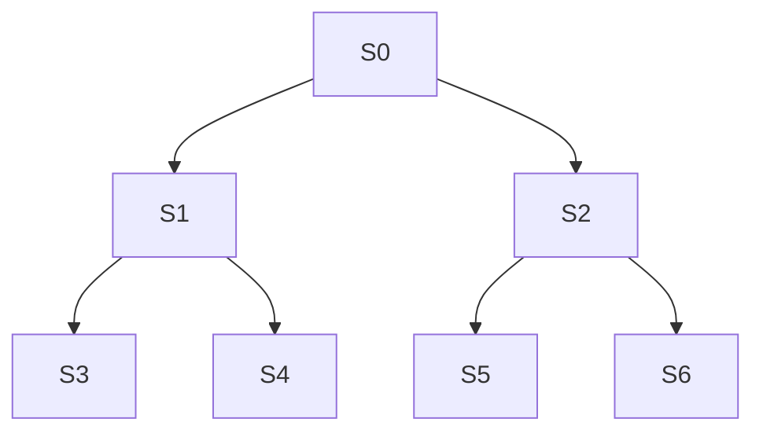

# Shikhandi Topology Generator

This project is a topology JSON generator for [Shikandi](https://github.com/srikanthccv/shikhandi),
light weight load generator for OpenTelemetry.

## Usage

```bash
usage: generator.py [-h] -s SERVICE_COUNT [-i MAX_INSTANCE_COUNT] [-r MAX_ROUTE_COUNT] [-d MAX_DOWNSTREAMCALL_COUNT] [-o OUTPUT_TOPOLOGY] [--console]

options:
  -h, --help            show this help message and exit
  -s SERVICE_COUNT, --service-count SERVICE_COUNT
                        Total number of services
  -i MAX_INSTANCE_COUNT, --max-instance-count MAX_INSTANCE_COUNT
                        Maximum number of instances
  -r MAX_ROUTE_COUNT, --max-route-count MAX_ROUTE_COUNT
                        Maximum number of routes
  -d MAX_DOWNSTREAMCALL_COUNT, --max-downstreamcall_count MAX_DOWNSTREAMCALL_COUNT
                        Maximum downstream calls count
  -o OUTPUT_TOPOLOGY, --output-topology OUTPUT_TOPOLOGY
                        File to write the generated topology JSON
  --console             Write generated topology JSON on console
```

## How Does It Work?

When running the generator script, `service-count` is mandatory, which
dictates how many services to generate.

The generator assumes that all services form a binary tree such that there are no
many random downstream calls or cyclic traversals. When creating downstream calls,
we traverse from from a node to its descendants service nodes.



For each of the services, we randomly generate the following:
- services metadata
- 1-3 instances
- 3 routes for first service and 1-3 routes for other services
- 2 common attribute sets
- 1 random attribute set
- event sets for the first service

## Examples

To generate topology JSON with 5 services:
```bash
python generator.py -s 5
```

_*Note: Above command generates `topology.json` file with 5 services with default configurations._

To generate topology JSON with 10 services to file `topology-tree.json`:
```bash
python generator.py -s 10 -o topology-tree.json
```

To generate topology JSON with 3 services and print to console:
```bash
python generator.py -s 10 --console
```
